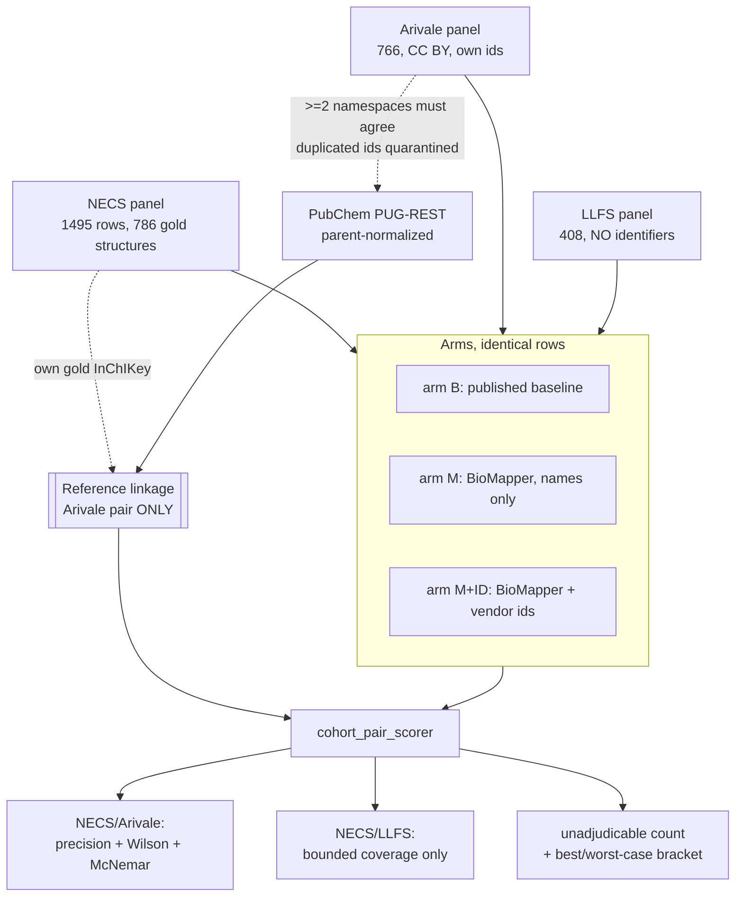

# feat: Cross-cohort metabolomics harmonization benchmark

## Overview

Add a benchmark to `studies/external_benchmarks` that compares BioMapper against the two
harmonization methods Monti et al. 2026 (GeroScience) used to align the NECS metabolomics panel with
other aging cohorts. They report coverage only; their methods structurally cannot produce an accuracy
figure. This benchmark produces an accuracy figure where structure permits one, and says so plainly
where it does not.

**This plan is v2.** A five-persona document review on 2026-08-04 found three P0 defects in v1, two of
which were experiment defects rather than document defects. All three were verified against the data
before revision (`scripts/review_probes.py`). Section "What the review changed" records them, because
the reasons are load-bearing for why the claims are shaped the way they now are.

## Problem Frame

A cross-cohort harmonization error silently merges two different molecules' effect estimates in a
replication analysis. Monti et al. matched NECS to Arivale on vendor `CHEMICAL_NAME` (615 metabolites)
and to LLFS on RefMet standardized names (163 metabolites), reporting neither precision nor recall
because name matching cannot self-validate.

Measured facts that pin the approach:

- **Coverage headroom over name matching is ~0 for same-vendor panels.** Name matching reaches 583 of
  766 Arivale analytes; adding shared-identifier matching adds 2.
- **The vendor's curated identifiers collide constitutional isomers, identically in both panels.**
  31 of 766 Arivale analytes (4%) carry a vendor id shared with another analyte: CAS `56-41-7` on both
  alanine and beta-alanine, KEGG `C01152` on both 1- and 3-methylhistidine, HMDB `11503` on both
  1- and 2-palmitoyl-GPE, PubChem `6912` on both ribitol and arabitol/xylitol.
- **Cross-vendor coverage collapses at the resolver, not the join.** RefMet standardizes 364 of 408
  LLFS names (89%) but only 1,066 of 1,495 NECS names (71%). The 429 unstandardizable NECS names are
  discarded by `drop_na(refmet_name)` before any join occurs.
- **Those 429 discarded names are mostly uncharacterizable.** 282 (66%) are unnamed `x-NNNNN` feature
  codes, and only 21 (5%) carry a gold InChIKey, against 72% among the names RefMet can standardize.

## What the review changed

| Finding | Verified as | Consequence |
|---|---|---|
| **The reference gold inherits the vendor collisions it exists to expose.** PUG-REST faithfully resolves alanine's CAS to alanine even sitting on the beta-alanine row, so the reference would assert NECS-alanine to Arivale-beta-alanine as true and omit the real edge. Arm B is scored wrong for being right; arm M+ID is scored right for colliding. | 31 of 766 Arivale analytes affected (4%) | Gold hardened: two-namespace agreement required, duplicated-id rows quarantined. Unit 3. The v1 circularity guard checked the wrong axis: independence from the KG is not independence from the vendor annotation. |
| **LLFS ships no registry identifiers at all.** All four sheets, zero identifier-like columns. | Confirmed across all sheets | Unit 3's "resolve their own registry ids" is impossible for LLFS. Structural adjudication of LLFS links is abandoned. |
| **The recall claim had a 21-row adjudicable ceiling.** | 21 of 429, with 282 being x-codes | The LLFS pair is recast from an accuracy claim to a bounded coverage claim. |

Also carried in from the review: an adjudicable-subset bias bracket, Wilson intervals and McNemar
tests in place of an n=3 range, salt and parent normalization, restrictive set semantics on the
oracle side, an explicit reproduction fidelity gate, a stated link-cardinality policy, an explicit
`annotation_mode` for arm M+ID, and pre-registration of the null disposition.

## Requirements Trace

- **R1.** Reimplement both published baselines faithfully, with a two-sided guard: raise on drift from
  our pinned value, and warn loud when our value diverges from the published one beyond a stated gate.
- **R2.** Produce precision, recall, and F1 for every arm on identical rows per cohort pair, with
  Wilson intervals, paired McNemar tests on discordant pairs, and the adjudicable N printed alongside.
- **R3.** Adjudicate correctness by structure whose evidence path is disjoint from every arm's
  evidence path. Not merely "not the KG."
- **R4.** Never score an unadjudicable link as correct or incorrect; count it, and bracket the metric
  over the excluded rows so the headline's external validity is bounded rather than assumed.
- **R5.** Test whether BioMapper inherits or resolves the vendor's isomer-colliding identifiers.
- **R6.** Report the unadjudicable fraction and the structural-adjudicability ceiling as a named
  finding, not a footnote.
- **R7.** Report the RefMet drop as a bounded coverage finding: how many named NECS metabolites the
  single-resolver bottleneck discards, how many BioMapper recovers, and how many of those can be
  independently verified.
- **R8.** Offline tests only. No test touches a live API.

## Scope Boundaries

- **No coverage claim for NECS/Arivale.** Measured at ~0.
- **No accuracy claim for NECS/LLFS.** LLFS ships no identifiers and the adjudicable ceiling is 21
  rows. The pair carries a bounded coverage claim only.
- **No adjudication of sum-composition lipid species.**
- **No Xu et al. comparison**, so the 385-versus-432 contradiction stays unresolved.
- **No BLSA arm.** Sized at a 93-analyte adjudicable ceiling.
- **No changes to `Linker`, the resolver, or any production mapping path.**

### Deferred to Separate Tasks

- Refining the sum-composition classifier: tracked in Unit 2, reported not required.
- Routing the adjudicated-conflict residual into an EITL campaign.
- A fourth arm running a purpose-built harmonizer (metLinkR is already adapted in-package). See the
  comparator note in Unit 6; if not run, the exclusion is stated explicitly rather than left silent.

## Pre-registration

Written before Unit 6 runs, so the result is interpretable in either direction.

| Pair | Primary metric | Supports the claim if | Reported as null if |
|---|---|---|---|
| NECS/Arivale | arm M precision minus arm B precision, on the hardened adjudicable subset | McNemar p below the stated threshold with arm M ahead | the CI on the discordant-pair difference crosses zero |
| NECS/LLFS | count of named, RefMet-discarded NECS metabolites BioMapper resolves | BioMapper resolves a materially larger share of the 147 named discards | BioMapper's resolution of the discards is comparable to RefMet's |

**Disposition if the head-to-head is null.** The applied section still stands on the two findings that
do not depend on BioMapper winning: the vendor-identifier isomer collision, and the structural
adjudicability ceiling. Both are measured, both are novel, neither is contingent. The preprint reports
the null with the same prominence as a win. This is committed now, not decided after the numbers land.

## Context & Research

### Relevant Code and Patterns

- `studies/external_benchmarks/adapters/metlinkr.py`: fetch/parse/SHA/card split, `force_ipv4`,
  fail-loud SHA pin before any scoring, held-out gold that never reaches BioMapper.
- `studies/external_benchmarks/scorers/metlinkr_scorer.py`: labelled oracles never merged,
  `assert_curator_held_out`, `needs_verification`, `UnscorableRunError` over a hollow rate.
- `studies/external_benchmarks/scorers/independent_inchikey.py`: the reference resolver. **It
  currently returns `_first_block(...)` and takes `splitlines()[0]` of the PUG-REST body.** Both must
  change (Unit 3): the strict key is uncomputable from a first block, and the single-line read is the
  `keys[0]` artifact living inside the resolver this plan depends on.
- `studies/external_benchmarks/competitors/base.py`: `HttpTransport`, `RateLimiter`, `ResponseCache`,
  `with_retries`, `CompetitorOutageError`.
- `studies/external_benchmarks/competitors/headtohead.py`: enforces identical denominators across
  tools (`HeadToHeadRowMismatchError`).
- `studies/external_benchmarks/competitors/orchestrate.py`: `build_default_clients` wires clients
  lazily. `competitors/__init__.py` holds only `ACCESS_NOTES` and is not a registry.
- `studies/external_benchmarks/figures/style.py`: provides `apply_figure_style()` and
  `frameless_legend()` but **no palette constant**; existing figures hardcode colors.
  `figures/__init__.py` sets the headless backend only and is not a registry.
- `studies/external_benchmarks/adapters/necs_metabolon.py`, `adapters/provided_id.py`, `runner.py`.

### Institutional Learnings

- `docs/solutions/best-practices/benchmark-scorer-defects-under-credited-resolver-2026-07-26.md`:
  the `keys[0]` artifact, worth 81 to 94 on Hajjar and 76.5 to 83.2 on NECS. Both sides of a
  comparison must pass through the same normalizer. A fix that lifts every arm uniformly is a scorer
  bug, not a result.
- `docs/solutions/best-practices/retest-benchmark-misses-in-provided-id-mode-before-expert-review-2026-08-03.md`:
  `provided_id_columns` resolves the vocabulary from the **column name** with fuzzy matching and
  expects **bare local ids**. A single column of prebuilt CURIEs named `provided_ids` matched to `PR`
  (Protein Ontology) and rejected 100% of identifiers on 1,495 rows while still producing a plausible
  number.
- `docs/solutions/best-practices/calibrating-external-crosswalk-null-results-2026-07-08.md`:
  an empty HTTP body is not a no-match. Ten workers produced 589 of 1,102 empty bodies. Prescribes
  ~4 workers, backoff, three-way parse outcome, and calibrating oracle recall on a known-positive
  control.
- `docs/solutions/best-practices/fail-closed-guards-must-not-no-op-on-absent-input-2026-07-13.md`:
  four P1s in this package, all guards no-opping on absent input while output was still emitted.
- `docs/solutions/best-practices/trustworthy-gates-invoke-test-real-shape-faithful-fallbacks-2026-08-04.md`:
  a gate is hollow if it is not on the run path, is tested against invented fixture shapes, or falls
  back in a way that does not preserve intent.
- `docs/solutions/best-practices/benchmark-miss-disposition-triage-before-eitl-2026-08-03.md`:
  flags RefMet-anchored comparison as partly circular with BioMapper's `metabolomics-workbench`
  annotator.
- `docs/solutions/workflow-issues/rss-pipeline-ipv6-fetch-hang-and-agentic-claude-preamble-2026-06-12.md`:
  IPv6 to CDN hosts is dead on this host; Python blocks where curl survives.
- `docs/solutions/runtime-errors/gitignore-globs-exclude-pinned-benchmark-data-2026-08-04.md`:
  repo-wide `*.csv`/`*.tsv` ignores make `git add <dir>` silently skip pinned data at exit 0.
- `docs/solutions/workflow-issues/shared-clone-concurrent-harness-branch-switch-2026-08-04.md`:
  the concurrent harness injects phantom index entries into `~/projects/biomapper2`. **Already hit
  once during this plan's own authoring**; commit by explicit path from an isolated worktree.

### External References

- Monti et al. 2026, GeroScience, doi 10.1007/s11357-026-02174-2.
- `montilab/monti_et_al_necs_metabolomics` v1.0.0, Zenodo 10.5281/zenodo.17107095.
  `03.platform.mapping.llfs.Rmd` defines the LLFS baseline: `refmet_convert(Compound.Name)`, then
  `drop_na(refmet_name)`, then `inner_join`.
- Watanabe et al. 2023, Nat Med 29:996-1008, PMC10115644, Supp Data 2. Arivale panel, CC BY.
- Sebastiani et al. 2024, Cell Rep 43:114913, PMC11656345, supplement 2. LLFS panel, CC BY-NC-ND.
- Metabolomics Workbench bulk RefMet service `name_to_refmet_new_min.php`.

## Key Technical Decisions

- **Arm M links on CURIE-set intersection, never on structure.** Forced: a structural link rule against
  a structural adjudicator is 100% precise by construction.
- **The adjudication key is block 1 plus the 8-character stereo hash.** Full-string is impossible
  against Metabolon's legacy two-block format; first-block alone merges 11 groups this domain must
  keep apart. First-block is reported as a labelled secondary.
- **Set semantics differ by side.** The KG side is permissive (any member intersects), preserving the
  `keys[0]` fix, because a node legitimately asserts several InChIKeys. **The oracle side is
  restrictive**: an id expanding past a small cardinality after parent normalization is ambiguous and
  routed to unadjudicable, because a promiscuous vendor id would otherwise fabricate reference edges
  and reward over-linking.
- **The gold requires two namespaces to agree.** A pair enters the reference only if two or more of
  HMDB, KEGG, PubChem, CAS independently resolve to the same key. Single-sourced or disagreeing rows
  go to unadjudicable. Any row whose vendor id appears on more than one analyte in either panel is
  hard-excluded: a duplicated id is prima facie evidence of a collided annotation.
- **Salt and parent normalization before comparison.** A CAS or PubChem id frequently names a salt,
  hydrate, or mixture, whose multi-component InChI has a completely different first block. Without
  parent normalization such a pair is adjudicable, non-intersecting, and penalizes every arm that
  correctly links it.
- **One shared canonicalization function**, called by both sides of every comparison.
- **The reference is deliberately incomplete, and its exclusions are biased.** Adjudicability
  correlates with being a well-characterized compound. The metric is therefore bracketed over the
  excluded rows rather than reported as if the subset were representative.
- **Unresolvable and throttled rows are excluded from denominators, never scored as misses.**
- **Panel sources normalize to bytes before hashing**, so the SHA pin is deterministic for a path,
  bytes, or a URL.
- **The resolution table is itself a pinned artifact.** PUG-REST and RefMet are mutable public
  services, so their captured responses get a sha256 and a UTC retrieval date recorded in config and
  verified fail-loud, exactly like the panels. Without this the comparison is internally stable but
  not externally reproducible.

## Open Questions

### Resolved During Planning

- *Which pair carries which claim?* Arivale carries precision on a hardened gold. LLFS carries a
  bounded coverage claim; its accuracy claim is withdrawn (21-row ceiling, no identifiers).
- *Full InChIKey or first block?* Block 1 plus the 8-character stereo hash, as sets, with side-specific
  permissive/restrictive semantics.
- *How is the gold protected from the collisions it tests?* Two-namespace agreement plus
  duplicated-id quarantine.
- *Can we reproduce their baselines?* Arivale 583 against their 615. LLFS 141 against their 163.

### Deferred to Implementation

- **The 22-pair LLFS reproduction gap.** Hypothesis: their `## mapping to refmet (mapping from
  original names > mapping from standardized)` comment implies a two-pass fallback. Now gated (R1)
  rather than merely noted, because the gap sits in exactly the population the coverage claim is about.
- **Whether Monti's Zenodo deposit ships the matched-pair lists** as well as the code. If it does, arm
  B can run against their published pair list as an upper bound rather than only our reimplementation.
- **How much refining the sum-composition classifier raises the adjudicable count.** Direction known
  (up only); magnitude not.
- **Measured PUG-REST oracle recall.** Must be measured against the control set named in Unit 3.
- **Whether arm M+ID inherits or resolves the vendor collisions.** This is the experiment.

## High-Level Technical Design

> *This illustrates the intended approach and is directional guidance for review, not implementation
> specification. The implementing agent should treat it as context, not code to reproduce.*

The load-bearing change from v1 is the Arivale edge label. Independence from the KG was never the
binding constraint; independence from the vendor annotation is, because that annotation is the thing
under test.

## Implementation Units

- [x] **Unit 0: Sizing gate for the precision pair. RAN 2026-08-04. RESULT: STOP.**

> **The precision claim is withdrawn.** Adjudicating the 11 name-match conflicts through an
> independent third path (PubChem name lookup, used by neither side of the original comparison)
> found **9 of 11 are NECS gold defects, not baseline errors**. Arm B's real error rate is 1 in 562
> verifiable pairs (99.8%), leaving no measurable headroom and a single discordant pair, which no
> test can use. Full result and the defect table:
> `~/external_benchmark_runs/cohort_panels_20260804/UNIT0_GATE_RESULT.md`.
>
> **Units 1 through 7 are on hold pending a decision on the restaged claim.** The gate worked: seven
> units were not built on a claim that does not exist.

**Goal:** Establish, before any code is written, that the hardened adjudicable subset for NECS/Arivale
is large enough to support a precision claim.

**Requirements:** R2, R4

**Dependencies:** None. This is a gate, mirroring the LLFS step-1 gate that already ran.

**Files:**
- Create: `scripts/arivale_step0_sizing.py`

**Approach:**
- Of the 583 name-matched pairs, count those where the NECS row has a valid gold InChIKey **and** the
  Arivale row has at least two namespaces present, after quarantining the 31 duplicated-id analytes.
- Note that `independent_inchikey.py` currently exposes only `block_for_hmdb` and `block_for_pubchem`.
  PUG-REST has no KEGG xref route, so KEGG and CAS need either new resolver methods or exclusion from
  the reference side. Record which namespaces are actually usable, since the two-namespace rule
  depends on it.
- **State a floor.** Below a stated adjudicable-pair count, the precision claim is withdrawn rather
  than reported with a caveat.

**Verification:**
- A number and a go/no-go, recorded in this plan before Unit 1 begins.

---

- [ ] **Unit 1: Canonicalization and adjudication key**

**Goal:** One shared function producing the adjudication key, with side-specific comparison semantics.

**Requirements:** R3

**Dependencies:** None

**Files:**
- Create: `studies/external_benchmarks/scorers/adjudication_key.py`
- Test: `studies/external_benchmarks/tests/test_adjudication_key.py`

**Approach:**
- Normalize the legacy two-block form and the standard three-block form to `block1 + "-" + block2[:8]`.
- Expose both key strengths from one function so the secondary metric needs no second implementation.
- **Two comparison predicates, not one.** `matches_kg_side` is permissive set intersection.
  `matches_oracle_side` is restrictive: the intersecting key must survive parent normalization, and an
  id expanding past a small cardinality is ambiguous rather than matching.
- Detect multi-component InChIKeys (salts, hydrates, mixtures) and route them to `None`.
- An unparseable input yields `None` with a warning, never a garbage key.

**Execution note:** Test-first. The correctness cases are enumerable from design.

**Test scenarios:**
- Happy path: legacy `ATHGHQPFGPMSJY-UHFFFAOYAK` and standard `ATHGHQPFGPMSJY-UHFFFAOYSA-N` give the
  same strict key.
- Edge case: each of the 11 first-block collision groups separates under the strict key. Assert
  fumarate `VZCYOOQTPOCHFL-OWOJBTEDBF` against maleate `VZCYOOQTPOCHFL-UPHRSURJBG` specifically.
- Edge case: gluconate and galactonate genuinely share a stereo hash and stay merged. Expected.
- Edge case: `matches_kg_side` returns true on any-member intersection. **This is the `keys[0]`
  regression guard and must fail if set logic degrades to `[0]`.**
- Edge case: `matches_oracle_side` returns false where `matches_kg_side` returns true, on an id whose
  key set exceeds the ambiguity cap.
- Edge case: a salt form and its free acid give the same strict key after parent normalization.
- Edge case: a multi-component record yields `None`, not a key.
- Error path: `"4000"`, empty string, `None`, and a malformed single-block value each yield `None`.

**Verification:**
- Both key strengths from one function; the 11 collision groups behave as measured (772 versus 785
  distinct keys over 786 NECS structures).

---

- [ ] **Unit 2: Panel adapters and config entries**

**Goal:** Load Arivale and LLFS into a common panel frame, SHA-pinned and fail-loud.

**Requirements:** R1, R6

**Dependencies:** None

**Files:**
- Create: `studies/external_benchmarks/adapters/arivale.py`
- Create: `studies/external_benchmarks/adapters/llfs.py`
- Modify: `studies/external_benchmarks/config.py` (`CohortPairConfig` plus two entries)
- Modify: `.gitignore` (LLFS already ignored; add a `!` negation for the committed Arivale copy so the
  repo-wide globs do not swallow it)
- Test: `studies/external_benchmarks/tests/test_arivale_adapter.py`
- Test: `studies/external_benchmarks/tests/test_llfs_adapter.py`

**Approach:**
- **These are adapters, not a new package.** `adapters/` already holds `necs_metabolon.py`,
  `refmet.py`, `provided_id.py` and the same fetch/SHA/card job. A separate `panels/` package would
  split one concept across two top-level packages with no boundary rule.
- **Normalize source to bytes before hashing** whether it arrives as path, bytes, or URL.
- Arivale: sheet `Arivale_Metabolomics`, 766 rows, carrying `BiochemicalName`, `CAS_ID`, `KEGG_ID`,
  `HMDB_ID`, `PubChem_ID`. HMDB zero-pads 5-digit to 7-digit; PubChem arrives as a float string.
  Pinned copy at `data/watanabe2023_supp_data2_analytes.xlsx`, **committed** (CC BY).
- LLFS: sheet `annotation`, 408 rows, carrying `Compound.Name`, `Standardized names (RefMet)`,
  `Formula`, `Exact.mass`, class hierarchy. **There are no identifier columns in any sheet**, so the
  adapter carries no id fields and the dataset card records that explicitly. `-` is the unmapped
  sentinel and normalizes to empty. Pinned copy at `data/NIHMS2038904-supplement-2.xlsx`,
  **gitignored** (CC BY-NC-ND, not redistributed), sha256 `16492c59...b3767f57`.
- Flag `sum_composition` per row from a shared conservative classifier.
- Flag `duplicated_vendor_id` per row: true when any of the row's ids appears on another analyte in
  the same panel. This is the quarantine signal Unit 3 consumes.
- Emit a `dataset_card` per panel mirroring `metlinkr.build_card`.

**Patterns to follow:**
- `adapters/metlinkr.py`, `adapters/necs_metabolon.py`.

**Test scenarios:**
- Happy path: 3-row in-memory fixtures for each panel yield the expected frames.
- Edge case: Arivale `HMDB01301` zero-pads to `HMDB0001301`; `1196.0` becomes `1196`.
- Edge case: LLFS `-` normalizes to empty and does not become a join key.
- Edge case: blank-name rows are dropped; id-less rows are retained with empty ids.
- Edge case: `duplicated_vendor_id` is true for alanine and beta-alanine (shared CAS `56-41-7`) and
  false for a uniquely identified analyte.
- Edge case: the sum-composition classifier flags `Triacylglyceride 14:0_36:2`, and the known
  over-flags (`ACar 10:0`, `LPC 16:0/0:0`) are pinned so a future refinement is a deliberate change.
- Error path: a SHA mismatch raises rather than parsing.
- Error path: a missing sheet or column raises with the tried names, never an empty column.
- Integration: the LLFS test over the real pinned file is **operator-only**, with an explicit
  skip-if-absent that records the skip reason, plus a companion test asserting the loader runs when
  the file is present, so an absent file never reads as a pass.

**Verification:**
- Both panels load to 766 and 408, SHA verification is on the load path, and
  `git archive HEAD data studies/external_benchmarks` extracted to a temp dir still imports and finds
  the committed Arivale copy. Note the `data` argument: the pinned files live at repo root, so
  archiving only `studies/external_benchmarks` would pass while proving nothing.

---

- [ ] **Unit 3: Structural reference linkage (Arivale pair only)**

**Goal:** Build a reference linkage whose evidence path is disjoint from every arm's evidence path.

**Requirements:** R3, R4

**Dependencies:** Unit 0, Unit 1, Unit 2

**Files:**
- Create: `studies/external_benchmarks/scorers/reference_linkage.py`
- Modify: `studies/external_benchmarks/scorers/independent_inchikey.py` (**return full InChIKey sets,
  not first blocks**; parent normalization; throttle-aware outcomes)
- Test: `studies/external_benchmarks/tests/test_reference_linkage.py`

**Approach:**
- **Scope: the Arivale pair only.** LLFS ships no identifiers, so there is no non-circular structural
  route for it. Resolving the LLFS RefMet name would make the reference circular with arm B and would
  give the rows arm B drops no reference key at all, which is exactly the population the LLFS claim is
  about.
- NECS side uses the curated `gold_inchikey`, excluding the 10 corrupt `"4000"` cells.
- Arivale side: **at least two of HMDB/KEGG/PubChem/CAS must independently resolve to the same key**
  (restricted to namespaces Unit 0 found actually resolvable). Single-sourced or disagreeing rows are
  unadjudicable. Rows flagged `duplicated_vendor_id` are hard-excluded.
- **Resolve to the PubChem parent CID before requesting the InChIKey**, so a salt or hydrate record
  does not produce a non-intersecting adjudicable pair that penalizes correct behavior.
- **The resolver's return shape must change.** It currently ends in `_first_block(...)` and reads
  `splitlines()[0]`. The strict key cannot be computed from a first block, and the single-line read
  silently truncates a multi-CID xref response. Return the full set.
- **Three-way parse outcome**: valid data, genuine no-match, or **throttled empty body which is
  retryable and never a negative.** About 4 workers, backoff, then flag `THROTTLED`.
- **Calibrate oracle recall on a named known-positive control** before declaring anything absent. Use
  a fixed control list of common metabolites with known PubChem entries, recorded in config so the
  measurement is comparable across runs, and deliberately including obscure compounds so recall is not
  overstated on the easy tail. Emit the measured recall.
- Persist the resolution table, **sha256 it, and record that hash plus the UTC retrieval date in
  config**, verified fail-loud like the panels.

**Execution note:** Characterization-first. This is shared code; pin current behavior before changing
its return shape.

**Test scenarios:**
- Happy path: two fixture rows whose ids agree across two namespaces produce one reference pair.
- Happy path: measured oracle recall is emitted and reflects the fixture's resolvable fraction.
- Edge case: **the beta-alanine case produces no reference edge in either direction**, and both rows
  land in unadjudicable. This is the regression guard for the P0.
- Edge case: a row resolvable in only one namespace is unadjudicable, not a reference pair.
- Edge case: two namespaces disagreeing routes to unadjudicable rather than picking one.
- Edge case: a PUG-REST body with three InChIKey lines yields a three-member set, not the first line.
- Edge case: one CAS expanding to five keys that intersect three distinct NECS rows produces **zero**
  reference edges, not three.
- Edge case: a CAS resolving only to a salt CID yields the parent key, or unadjudicable if no parent.
- Error path: an empty body is retried and, if still empty, flagged `THROTTLED` and excluded from the
  denominator. **Assert the counts differ between a genuine no-match and a throttled empty body.**
- Error path: a permanent non-200 after retries surfaces as an outage, not 0% coverage.
- Error path: only complete successful responses are cached; a `None` is never persisted, so a
  transient failure cannot poison the cache permanently.
- Integration: the builder never touches the KG. Assert with a KG client that raises if called.

**Verification:**
- Reproducible from the persisted, hash-pinned resolution table with the network disabled, with
  measured oracle recall present in the output.

---

- [ ] **Unit 4: Cohort-pair scorer**

**Goal:** Score arms against the reference with honest uncertainty and a bounded external-validity
claim.

**Requirements:** R2, R4, R6

**Dependencies:** Unit 1, Unit 3

**Files:**
- Create: `studies/external_benchmarks/scorers/cohort_pair_scorer.py`
- Test: `studies/external_benchmarks/tests/test_cohort_pair_scorer.py`

**Approach:**
- Precision, recall, F1 inside the adjudicable subset, with the **adjudicable N printed alongside
  every metric**.
- **Wilson score intervals** on every figure, and a **paired McNemar exact test on the discordant-pair
  table** for each arm-versus-arm contrast, since all arms are scored on identical rows. The n=3 range
  stays, but it measures BioMapper's own nondeterminism, not sampling uncertainty over roughly a
  hundred pairs, and must not be used as a significance test.
- **Selection-bias bracket.** Adjudicability correlates with being well characterized: the rows
  without gold structure are disproportionately `x-NNNNN` codes where exact name matching across two
  same-vendor panels is trivially correct, so excluding them removes the baseline's easy correct mass
  while keeping its hard errors. Emit (a) a composition comparison of adjudicable versus unadjudicable
  rows on named-versus-`x-`-code, polar-versus-sum-composition, and id presence, and (b) a best-case
  and worst-case recomputation counting all unadjudicable asserted links first as correct then as
  incorrect, reported as the interval the true value lies within.
- Report strict as primary and first-block as a labelled secondary from the same run.
- **Guards on the line between scored and persisted**: `UnscorableRunError` on an empty adjudicable
  subset, an anti-trivial assertion that gold columns never reach an arm's input, and a **disjoint
  evidence-path assertion** that raises when the reference's inputs overlap an arm's inputs. That last
  one replaces v1's "resolver is not the KG", which checked the wrong axis.

**Execution note:** Test-first, including a deliberately circular fixture that must raise.

**Test scenarios:**
- Happy path: an arm asserting 3 links of which 2 are in the reference yields precision 2/3 against the
  adjudicable denominator, with a Wilson interval and the N printed.
- Happy path: recall is computed against reference size, not asserted size.
- Edge case: a link outside the adjudicable subset lands in unadjudicable and moves neither metric.
- Edge case: the best/worst bracket is emitted and its width is non-zero whenever unadjudicable > 0.
- Edge case: strict and first-block metrics both emitted, differing on a fumarate/maleate fixture.
- Edge case: McNemar is computed on discordant pairs only, and the discordant counts are shown.
- Error path: zero adjudicable pairs raises `UnscorableRunError`.
- Error path: a fixture whose reference derives from an arm's own inputs trips the evidence-path
  assertion.
- Error path: an arm whose input contains a held-out gold column trips the anti-trivial assertion.
- Integration: **guard-arming tests proving each assertion is reachable from the public entry point**,
  not merely defined.
- Integration: all arms are scored by one code path on one denominator, so a scorer change cannot lift
  one arm without lifting the others.

**Verification:**
- No path from arm output to a persisted number bypasses the identical-denominator assertion, verified
  by reading the run path rather than by test count.

---

- [ ] **Unit 5: Baseline arms**

**Goal:** Reimplement both published baselines, with fidelity gated rather than assumed.

**Requirements:** R1

**Dependencies:** Unit 2

**Files:**
- Create: `studies/external_benchmarks/competitors/vendor_name_match.py`
- Create: `studies/external_benchmarks/competitors/refmet_nameconvert.py`
- Modify: `studies/external_benchmarks/competitors/orchestrate.py` (add both to the lazy wiring;
  `competitors/__init__.py` holds only `ACCESS_NOTES` and needs an entry there for hosted services)
- Test: `studies/external_benchmarks/tests/test_competitors_vendor_name_match.py`
- Test: `studies/external_benchmarks/tests/test_competitors_refmet_nameconvert.py`

**Approach:**
- `vendor_name_match` is local: case-insensitive exact match. Case-insensitivity undoes an export
  artifact (all NECS names are lowercase, Arivale's are mixed) rather than doing chemistry. **Do not
  normalize further**: the next rung matches `x-07765` to `X - 11261` and invents pairs.
- `refmet_nameconvert` wraps the Metabolomics Workbench bulk endpoint, subclassing `competitors/base.py`
  for rate limiting, caching, bounded retry, and `CompetitorOutageError`. Batches of about 250. Replicate
  their semantics exactly: standardize, `drop_na`, inner join. **The drop is the behavior under test**,
  so reproduce it faithfully and report its count. Record the service response date.
- Note `adapters/refmet.py` already exists but consumes the bulk CSV download, not the name-conversion
  endpoint. The new client is genuinely distinct, though both now hold Workbench knowledge and can drift.
- **Two-sided reproduction guard.** Raise on drift from our pinned value (583, 141). **Separately, warn
  loud when the gap to the published figure exceeds a stated gate**, because v1's guard pinned only our
  own value and therefore could never detect that our reimplementation was unfaithful. The LLFS gap is
  13.5% and sits in exactly the population the coverage claim is about, so it is gated, not noted.
- Check whether Monti's Zenodo deposit ships the matched-pair lists. If so, run arm B against their
  published list as a `B-published` upper bound and score the reimplementation as secondary. If not,
  implement the two-pass fallback before any coverage number is generated and report both variants.

**Test scenarios:**
- Happy path: vendor name match reproduces the expected pair count on a fixture.
- Happy path: the RefMet client parses a **snapshot of a real service response**, not an invented dict.
- Edge case: names differing only in case match; names differing in punctuation do not.
- Edge case: a `-` result is dropped and the drop count is reported rather than silent.
- Edge case: batching splits and reassembles without loss or duplication.
- Error path: a transient 429 or 503 is retried; a permanent failure raises `CompetitorOutageError`.
- Error path: the reproduction guard raises on drift from the pinned value.
- Error path: the fidelity gate warns when the published gap exceeds the stated threshold.
- Integration: an import-purity check run **in a subprocess**, since an in-process `sys.modules`
  assertion passes spuriously once other test modules have imported the plugins.
- Integration: no test performs live HTTP, asserted by injecting a transport that raises.

**Verification:**
- Arm B reproduces 583 and 141, the published gaps are reported and gated, and the suite passes with
  the network unavailable.

---

- [ ] **Unit 6: BioMapper arms and runner wiring**

**Goal:** Run arms M and M+ID and hand every arm to the scorer on identical rows.

**Requirements:** R2, R5, R7, R8

**Dependencies:** Unit 4, Unit 5

**Files:**
- Create: `studies/external_benchmarks/cohort_pair_runner.py` (top-level module, matching the existing
  flat `runner.py`; no new `runners/` package for a single file)
- Modify: `studies/external_benchmarks/run.py` (register the benchmark)
- Test: `studies/external_benchmarks/tests/test_cohort_pair_runner.py`

**Approach:**
- Arm M hands each panel only its name column with `provided_id_columns=[]`.
- **Arm M+ID must state its `annotation_mode` explicitly.** The harness's provided-id machinery is
  either/or, not names-plus-ids: `ProvidedIdDatasetConfig` hardcodes `annotation_mode="none"` ("no
  name-resolution, pure provided-ID equivalence expansion") and `adapters/provided_id.py` writes an
  empty placeholder name column. Under `"none"`, arm M+ID is ids-only and every row without a vendor
  id returns nothing, so M+ID would lose to M for reasons unrelated to the isomer hypothesis it exists
  to test. Arm M+ID runs with names still resolving, and a test asserts a row with a name but no
  vendor id still resolves, so the M-versus-M+ID delta isolates id poisoning from id absence.
- `build_provided_input_df` emits a single `source_id_column` and `ProvidedIdDatasetConfig.__post_init__`
  forbids multiple source namespaces, so **Unit 6 needs a new multi-vocab input builder**, not reuse,
  and `CohortPairConfig` carries a tuple of (vocab, column) pairs.
- **One column per vocabulary, named for the vocabulary (`HMDB`, `KEGG`, `PUBCHEM`, `CAS`), carrying
  bare local ids, never prebuilt CURIEs in a single column.**
- **Provided-ID plumbing guard**: if `chosen_kg_id_provided` is empty across all rows, raise. A
  silently empty M+ID arm degenerates into a duplicate of M and reads as "identifiers do not help."
- **Link cardinality policy, stated.** Arm B asserts a near-one-to-one set (583 links); arm M asserts a
  link for every pair whose CURIE sets intersect across a 1,495 by 766 cross product, so one
  over-general CURIE could produce a combinatorial block. Fix the policy for all arms and **report
  asserted-links-per-row per arm as a first-class column**, so a blowup is visible rather than absorbed
  into precision.
- **NECS is mapped once per arm per replicate**, not once per cohort pair. Its input is byte-identical
  across pairs for a given arm, so a naive per-pair runner doubles the most expensive step. Persist the
  per-panel mapping artifact keyed by (panel SHA, arm, replicate) and have pair runners consume it.
- State a run budget (rows times replicates, expected wall clock) and mark live steps **gated**,
  following the `competitors/orchestrate.py` convention, so it is clear which Verification bullets the
  offline suite proves and which need an operator run.
- **Comparator note.** metLinkR is already adapted in-package and the identical-rows machinery makes a
  fourth arm nearly free. Either run it, or state in Scope Boundaries which purpose-built harmonizers
  were considered and why each was excluded. An explicit reasoned exclusion survives review; silence
  does not.
- Persist every run unconditionally with `PROVENANCE.md` pinning panel SHAs, the resolution-table hash
  and date, the RefMet service date, and the KG snapshot identifier. Saving is never behind a flag.

**Execution note:** The provided-ID guard is the highest-value test here. Write it before the arm.

**Test scenarios:**
- Happy path: arm M links rows whose CURIE sets intersect and not those whose sets are disjoint.
- Edge case: arm M+ID column construction produces one column per vocabulary with bare local ids,
  asserted against the exact names the normalizer expects.
- Edge case: under arm M+ID's chosen `annotation_mode`, a row with a name but no vendor id still
  resolves.
- Edge case: asserted-links-per-row is emitted per arm.
- Error path: **a mapper stub returning empty `chosen_kg_id_provided` on every row raises**, and the
  message names the arm. Regression guard for the fictitious-result incident.
- Error path: an arm scored on a different row set than its siblings raises.
- Integration: all arms reach the scorer with identical denominators, asserted not assumed.
- Integration: NECS is mapped once per (arm, replicate) and reused across pairs, asserted by counting
  mapper invocations.
- Integration: a run persists artifacts even when scoring raises, so an expensive mapper run is never
  discarded.

**Verification:**
- All arms produce numbers, the M+ID arm demonstrably exercised the provided-id path, and every delta
  carries both its n=3 range and its Wilson interval.

---

- [ ] **Unit 7: Results assembly and figures**

**Goal:** Assemble the results and figures the preprint needs, with measured metrics visibly separated
from reported context.

**Requirements:** R2, R6, R7

**Dependencies:** Unit 6

**Files:**
- Create: `studies/external_benchmarks/report/cohort_pair.py`
- Create: `studies/external_benchmarks/figures/cohort_pair_panel.py`
- Modify: `studies/external_benchmarks/figures/style.py` (add the categorical palette as a shared
  constant; it currently has `apply_figure_style()` and `frameless_legend()` but no palette, and the
  two existing figures hardcode colors)
- Test: `studies/external_benchmarks/tests/test_cohort_pair_report.py`

**Approach:**
- **Report the full metric matrix for every arm on both pairs**, with F1 as the headline per pair, so
  the per-pair claim assignment describes where the headroom lies rather than which metric is shown.
  Reporting only precision for Arivale and only coverage for LLFS invites a cherry-picking objection
  over a table we already have.
- Separate columns, visibly not part of the metric: adjudicable N, unadjudicable count, the best/worst
  bracket, and the reproduction delta.
- **A scope-of-benefit statement**, stated rather than left for the reader to infer: where two panels
  share a vendor and an annotation table, exact name matching already recovers about 76% of analytes
  and identifier matching adds about zero, so BioMapper's value on such pairs is the correctness of the
  asserted links, not their number. Report the ~0 headroom as a deliberate finding.
- **The LLFS coverage figure**, bounded: RefMet discards 429 of 1,495 NECS names, of which 282 are
  unidentifiable `x-` codes, leaving 147 named metabolites; BioMapper resolves N of those; of the 21
  where independent structure exists, Y are verified. State plainly that the remainder is unverified,
  since claiming otherwise is precisely the criticism this benchmark makes of name matching.
- **The adjudicability ceiling figure** for R6: how much of each panel structure can reach, with the
  sum-composition lipid fraction called out.
- Emit the circularity note for the LLFS pair: the RefMet baseline partly overlaps BioMapper's own
  `metabolomics-workbench` annotator. Record the RefMet service date and the KG snapshot's ingest date
  so a coverage difference is not silently a difference of service vintage.

**Test scenarios:**
- Happy path: a fixture result assembles into a full arm-by-metric matrix for both pairs.
- Edge case: an arm with `None` precision renders as unscorable, never as zero.
- Edge case: the unadjudicable count is never summed into precision or recall, asserted numerically.
- Edge case: no arm-metric cell is omitted from the assembled table.
- Error path: assembling arms with mismatched denominators raises.
- Error path: the report fails to assemble if the resolution-table hash or either service date is
  absent.

**Verification:**
- Measured metrics are distinguishable from reported context at a glance, and no figure renders a
  number the scorer marked unscorable.

## System-Wide Impact

- **Interaction graph:** New code is confined to `studies/external_benchmarks`. The one shared file
  modified is `scorers/independent_inchikey.py`. Its actual consumers are **`run.py`,
  `rescore_id_equivalence.py`, and `scorers/id_equivalence.py`** (`UniChemIdEquivalenceJudge.pubchem_resolver`,
  which compares the returned value as a first block). `metlinkr_scorer.py` consumes it structurally via
  the `IndependentInChIKeyResolver` Protocol (`block_for_hmdb` / `block_for_pubchem` returning
  `str | None`) with an instance injected by `run.py`. Changing the return type breaks that Protocol
  and the UniChem first-block fallback **silently**, since a full key or a `THROTTLED` sentinel flowing
  into a first-block comparison yields wrong verdicts without an exception. Prefer adding new methods
  over changing existing signatures so the Protocol stays satisfied.
- **Error propagation:** Outages, throttling, and unscorable runs fail loud and distinctly. An outage
  never surfaces as 0% coverage; a throttled response never surfaces as a no-match.
- **State lifecycle risks:** The PUG-REST cache. Cache only complete successful responses, never persist
  `null`, do not trust legacy nulls on load. The current `except Exception: return None` caches negatives
  in the same dict and must change. Adding concurrency also raises thread-safety questions for the
  single `requests.Session` and unlocked dict cache.
- **API surface parity:** None. No public interface changes.
- **Integration coverage:** The identical-denominator invariant, the provided-ID plumbing guard, and the
  evidence-path disjointness assertion are all cross-layer.
- **Unchanged invariants:** `Linker`, `Normalizer`, the resolver, and every production mapping path are
  untouched. `metlinkr_scorer.py` **and** `rescore_id_equivalence` numbers must both stay put; checking
  only metLinkR would pass while id-equivalence numbers moved.

## Risks & Dependencies

| Risk | Mitigation |
|------|------------|
| Reference gold inherits the vendor collisions it tests, inverting the precision claim | Two-namespace agreement, duplicated-id quarantine, parent normalization, and a beta-alanine regression test asserting no reference edge. Unit 3. |
| Adjudicable subset is a biased sample, so the headline does not generalize | Composition comparison plus a best/worst-case bracket, both emitted. Unit 4. |
| Precision effect size is too small to detect on the adjudicable N | Unit 0 sizes it before any code, with a stated floor below which the claim is withdrawn. |
| PUG-REST throttling shrinks the subset and silently moves every arm | Three-way parse outcome, ~4 workers with backoff, `THROTTLED` excluded, measured oracle recall on a named control. Unit 3. |
| The M+ID arm resolves nothing and reads as "identifiers do not help" | Fail-loud guard on empty `chosen_kg_id_provided`, written before the arm. Unit 6. |
| M+ID loses to M because of id absence rather than id poisoning | Explicit `annotation_mode` with names still resolving, plus a test. Unit 6. |
| Our baseline is a strawman of theirs (141 versus published 163) | Two-sided fidelity gate, `B-published` upper bound from their Zenodo pair list if available, otherwise implement the two-pass fallback before any number. Unit 5. |
| Adjudication key compares only the first of a node's InChIKeys | Set membership with a regression test that fails if it degrades to `[0]`. Unit 1. |
| A promiscuous vendor id fabricates reference edges and rewards over-linking | Restrictive oracle-side semantics with an ambiguity cap. Unit 1, Unit 3. |
| A salt or hydrate CID makes a correct link score as a false positive | Parent normalization before comparison; multi-component records route to unadjudicable. Unit 1, Unit 3. |
| A scorer defect lifts all arms and reads as a win | One code path, one denominator; a uniform lift is a bug, not a result. Unit 4. |
| LLFS coverage delta is a service-vintage difference, not a method difference | Record the RefMet service date and the KG snapshot ingest date; the report fails to assemble without them. Unit 7. |
| Results are internally stable but not externally reproducible | The resolution table is hash-pinned and dated in config, and deposited as a supplementary artifact. Unit 3. |
| Pinned data silently gitignored, breaking a fresh checkout | `git archive HEAD data studies/external_benchmarks`, note the `data` argument. Unit 2. |
| Concurrent harness injects phantom index entries in the shared clone | Isolated worktree, commit by explicit path. **Already hit once during this plan's authoring.** |
| IPv6 to CDN hosts is dead, so Python hangs where curl succeeds | IPv4 forcing on both network clients, reusing `metlinkr.force_ipv4`. |

## Documentation / Operational Notes

- Add a `docs/solutions/` entry if the two-pass RefMet fallback explains the 22-pair gap, since that is
  a reusable finding about reproducing published harmonizations. Add another for the gold-inherits-the-
  collision failure mode, which generalizes to any benchmark whose reference is built from the same
  annotation layer it evaluates.
- Run artifacts land in `~/external_benchmark_runs/<run>/` with `PROVENANCE.md` by default. Design-phase
  artifacts are at `~/external_benchmark_runs/cohort_panels_20260804/`.
- PR opens on the personal fork `trentleslie/biomapper2` against `dev` for Greptile first, then
  Phenome-Health.

## Sources & References

- **Origin document:** `docs/superpowers/specs/2026-08-04-cross-cohort-harmonization-benchmark-design.md`
- Gate scripts: `scripts/llfs_step1_sizing.py`, `scripts/review_probes.py`, `scripts/arivale_step0_sizing.py`
- Direct analog: `studies/external_benchmarks/adapters/metlinkr.py`,
  `studies/external_benchmarks/scorers/metlinkr_scorer.py`
- Monti et al. 2026, GeroScience, doi 10.1007/s11357-026-02174-2
- `montilab/monti_et_al_necs_metabolomics` v1.0.0, Zenodo 10.5281/zenodo.17107095
