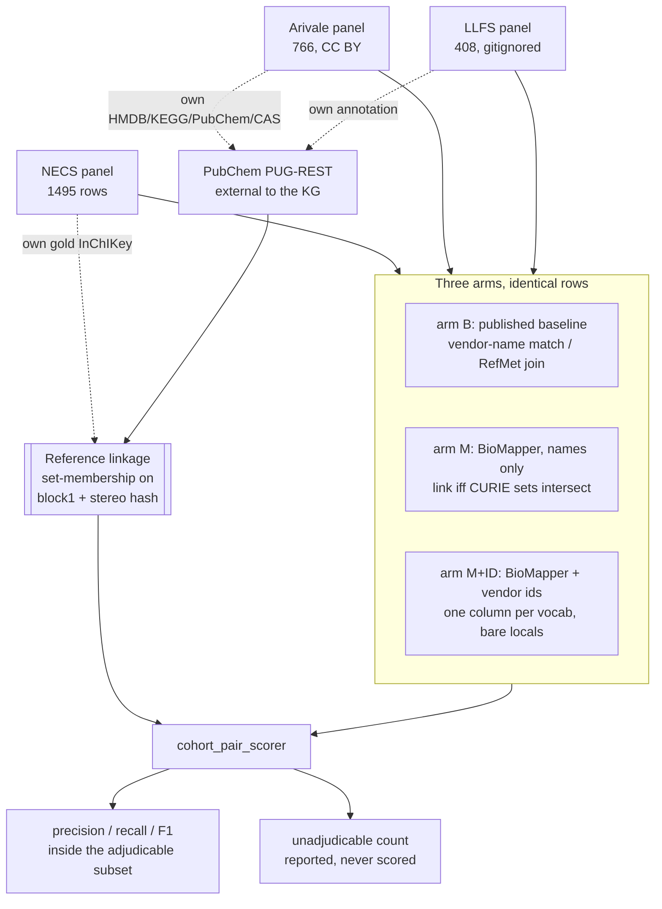

# feat: Cross-cohort metabolomics harmonization benchmark

## Overview

Add a benchmark to `studies/external_benchmarks` that compares BioMapper against the two
harmonization methods Monti et al. 2026 (GeroScience) used to align the NECS metabolomics panel
with other aging cohorts. They report coverage only; their methods structurally cannot produce an
accuracy figure. This benchmark produces precision and recall for their method and ours on identical
rows, adjudicated by structure resolved outside the Kraken KG.

Two cohort pairs, three arms each. The step-1 viability gate has already passed.

## Problem Frame

A cross-cohort harmonization error silently merges two different molecules' effect estimates in a
replication analysis. Monti et al. matched NECS to Arivale on vendor `CHEMICAL_NAME` (615 metabolites)
and to LLFS on RefMet standardized names (163 metabolites), reporting neither precision nor recall
because name matching cannot self-validate.

Three facts measured during design pin the approach (see origin doc sections 3.1 through 3.5):

- **Coverage headroom over name matching is ~0 for same-vendor panels.** Name matching reaches 583
  of 766 Arivale analytes; adding shared-identifier matching adds 2. A coverage claim on this pair
  would be false.
- **The vendor's curated identifiers collide constitutional isomers, identically in both panels.**
  `beta-alanine` carries alanine's CAS `56-41-7`; 1- and 3-methylhistidine share KEGG `C01152`;
  o- and p-cresol sulfate share HMDB `0011635`. Upgrading from names to vendor IDs merges molecules
  that names kept apart.
- **Cross-vendor coverage collapses at the resolver, not the join.** RefMet standardizes 364 of 408
  LLFS names (89%) but only 1,066 of 1,495 NECS names (71%). The 429 unstandardizable NECS names are
  discarded by `drop_na(refmet_name)` before any join occurs.

## Requirements Trace

- **R1.** Reimplement both published baselines faithfully enough to reproduce their reported counts,
  and pin the reproduction so drift fails loud (origin section 7).
- **R2.** Produce precision, recall, and F1 for all three arms on identical rows per cohort pair.
- **R3.** Adjudicate correctness by structure resolved outside the KG, so the comparison is not
  circular (origin section 5).
- **R4.** Never score an unadjudicable link as correct or incorrect; count and report it separately.
- **R5.** Test whether BioMapper inherits or resolves the vendor's isomer-colliding identifiers
  (arm M+ID, origin section 4).
- **R6.** Report the unadjudicable fraction, broken out by sum-composition lipid species, as a named
  boundary of structure-only validation.
- **R7.** Offline tests only. No test touches a live API.

## Scope Boundaries

- **No coverage claim for NECS/Arivale.** Measured at ~0; the pair carries the precision claim only.
- **No adjudication of sum-composition lipid species.** A species-set standard for lipids was
  considered and declined during design.
- **No Xu et al. comparison**, so the 385-versus-432 contradiction in Monti's text stays unresolved.
- **No BLSA arm.** Sized during design at a 93-analyte adjudicable ceiling (19% of panel).
- **No changes to `Linker`, the resolver, or any production mapping path.** This is a study package.

### Deferred to Separate Tasks

- Refining the sum-composition classifier beyond the current conservative rule: tracked in Unit 2,
  but any gain it produces is reported, not required for the headline claim.
- Routing the adjudicated-conflict residual into an EITL campaign: separate work, connects to the
  existing campaign thread.

## Context & Research

### Relevant Code and Patterns

The direct analog is the metLinkR arm, which already does "published method reports agreement, we
add an independent structural oracle":

- `studies/external_benchmarks/adapters/metlinkr.py`: source fetch isolated behind one function,
  fail-loud SHA pin before any scoring, `force_ipv4` context manager, adapter emits `input_df` plus
  a `dataset_card`, held-out gold rides alongside and is never handed to BioMapper.
- `studies/external_benchmarks/scorers/metlinkr_scorer.py`: dual labelled oracles never merged,
  `assert_curator_held_out` anti-trivial guard, `needs_verification` bucket for rows the external
  resolver cannot cover, explicit `UnscorableRunError` rather than a hollow rate.
- `studies/external_benchmarks/scorers/independent_inchikey.py`: PubChem PUG-REST resolution of a
  gold-side id to an InChIKey block, cached, IPv4-forced, fail-soft per id. This is the reference
  resolver; it needs the throttle hardening in Unit 3.
- `studies/external_benchmarks/competitors/base.py`: `HttpTransport`, `RateLimiter`,
  `ResponseCache`, `with_retries`, and `CompetitorOutageError` so an outage is never scored as 0%
  coverage. Both baseline clients subclass this.
- `studies/external_benchmarks/competitors/headtohead.py`: enforces that every tool was scored on
  the identical denominator (`HeadToHeadRowMismatchError`). The three-arms-on-identical-rows
  invariant is the same shape.
- `studies/external_benchmarks/adapters/necs_metabolon.py`: the NECS panel loader, reused unchanged.
- `studies/external_benchmarks/adapters/provided_id.py`: the machinery arm M+ID uses.

### Institutional Learnings

- `docs/solutions/best-practices/benchmark-scorer-defects-under-credited-resolver-2026-07-26.md`:
  the `keys[0]` artifact. A node asserts multiple InChIKeys (neutral parent, anion, salt,
  stereoisomers); scoring only the first cost Hajjar 81→94 and NECS 76.5→83.2. **The adjudication
  key must be set membership over all asserted InChIKeys.** Same doc: both sides of a comparison
  must pass through the same normalizer, and a fix that lifts every arm uniformly is a scorer bug,
  not a result.
- `docs/solutions/best-practices/retest-benchmark-misses-in-provided-id-mode-before-expert-review-2026-08-03.md`:
  `provided_id_columns` resolves the vocabulary from the **column name** via
  `Normalizer.determine_vocab()` with fuzzy matching, and expects **bare local ids**. A single
  column of prebuilt CURIEs named `provided_ids` fuzzy-matched to `PR` (Protein Ontology) and
  rejected 100% of identifiers on all 1,495 rows while still producing a plausible number.
- `docs/solutions/best-practices/calibrating-external-crosswalk-null-results-2026-07-08.md`:
  an empty HTTP body is not a no-match. Ten concurrent workers produced 589 of 1,102 empty bodies
  indistinguishable from absence. Prescribes ~4 workers, backoff, a three-way parse outcome, and
  calibrating oracle recall against a known-positive control before calling anything absent.
- `docs/solutions/best-practices/fail-closed-guards-must-not-no-op-on-absent-input-2026-07-13.md`:
  four P1s in this exact package, all "guard silently no-ops when its input is absent," with figures
  and reports still emitted. Includes the fix of normalizing URL to bytes up front so the SHA pin
  stays deterministic.
- `docs/solutions/best-practices/trustworthy-gates-invoke-test-real-shape-faithful-fallbacks-2026-08-04.md`:
  three ways a fail-closed gate is hollow: not actually on the run path, tested against invented
  fixture shapes rather than the real producer's, and fallbacks that do not preserve semantic intent.
- `docs/solutions/best-practices/benchmark-miss-disposition-triage-before-eitl-2026-08-03.md`:
  flags that a RefMet-anchored comparison is partly circular with BioMapper's own
  `metabolomics-workbench` annotator. Name it and report the circular control.
- `docs/solutions/workflow-issues/rss-pipeline-ipv6-fetch-hang-and-agentic-claude-preamble-2026-06-12.md`:
  this host's IPv6 route to CDN-fronted hosts is dead. `curl` survives via Happy Eyeballs; Python
  `urllib`/`requests` block roughly 30s per dead AAAA. Both PubChem PUG-REST and the Metabolomics
  Workbench name service need IPv4 forcing.
- `docs/solutions/runtime-errors/gitignore-globs-exclude-pinned-benchmark-data-2026-08-04.md`:
  repo-wide `*.csv`/`*.tsv` ignores make `git add <dir>` silently skip pinned data with exit 0,
  while local tests still pass. Verify with `git archive`, not `git status`.
- `docs/solutions/best-practices/generic-base-under-eager-importing-plugin-package-2026-08-03.md`:
  if `competitors/__init__.py` eager-imports clients to populate a registry, adding clients drags
  every competitor's network deps into import time. Verify import purity in a subprocess.

### External References

- Monti et al. 2026, GeroScience, doi 10.1007/s11357-026-02174-2, the methods being reproduced.
- `montilab/monti_et_al_necs_metabolomics` v1.0.0, Zenodo 10.5281/zenodo.17107095, their
  harmonization code. `03.platform.mapping.llfs.Rmd` defines the LLFS baseline exactly:
  `refmet_convert(Compound.Name)` then `drop_na(refmet_name)` then `inner_join`.
- Watanabe et al. 2023, Nat Med 29:996-1008, PMC10115644, Supp Data 2, Arivale panel, CC BY.
- Sebastiani et al. 2024, Cell Rep 43:114913, PMC11656345, supplement 2, LLFS panel, CC BY-NC-ND.
- Metabolomics Workbench bulk RefMet service `name_to_refmet_new_min.php`: verified during design
  to return exactly the columns in Monti's published `annotation` sheet.

## Key Technical Decisions

- **Arm M links on CURIE-set intersection, never on structure.** Forced, not chosen: if the linking
  rule and the adjudicator were both structural identity, precision would be 100% by construction.
  Mirrors `metlinkr_scorer.py`.
- **The adjudication key is the InChIKey first block plus the 8-character stereo hash, compared as
  sets.** Full-string matching is impossible because Metabolon ships legacy two-block keys whose
  trailing characters are not byte-comparable. First-block-only merges 11 groups that this domain
  must keep apart (fumarate/maleate, myo-/chiro-inositol, lactose/maltose, cis/trans-urocanate,
  bilirubin isomers, ursodeoxycholate/isoursodeoxycholate, threonate/erythronate). Set membership
  rather than a single key, per the `keys[0]` learning. **First-block is reported as a labelled
  secondary** for continuity with prior NECS numbers and because the learnings note the strict key's
  residual is largely same-molecule convention variance.
- **One shared canonicalization function**, called by both sides of every comparison. Never two
  copies that can drift.
- **The reference linkage is deliberately incomplete**, and that is encoded rather than hidden: a
  link outside the adjudicable subset is `unadjudicable`, never an error.
- **Unresolvable rows are excluded from denominators, not scored as misses.** Applies to PUG-REST
  non-coverage and to throttled responses alike.
- **A throttled empty body is retryable, never a negative.** Three-way parse outcome, per the
  crosswalk-calibration learning.
- **Panel sources are normalized to bytes before hashing**, so the SHA pin is deterministic whether
  the source is a local path or a URL.
- **The LLFS panel file is gitignored** (CC BY-NC-ND, not redistributed); its sha256
  `16492c59...b3767f57` is pinned in config and verified fail-loud on load.

## Open Questions

### Resolved During Planning

- *Which cohort carries the recall arm?* LLFS. Sized during design: 53% discrete molecules and 111
  of 141 overlapping pairs adjudicable (79%), against BLSA's 19% ceiling.
- *Full InChIKey or first block?* Neither. Block 1 plus the 8-character stereo hash, as sets. Full
  string is impossible against Metabolon's legacy format; first block alone merges real isomers.
- *Can we reproduce their baselines?* Arivale yes at 583 against their 615, the gap attributed to
  their documented manual curation. LLFS 141 against their 163.
- *Do we need a live RefMet call, or can we use their published RefMet names?* Both. Their
  `annotation` sheet carries precomputed RefMet names for LLFS, so the LLFS side is reproducible
  from their own artifact, and the live service independently verifies it and supplies the NECS side
  (NECS's `gold_refmet` column is a boolean presence flag, not a name).

### Deferred to Implementation

- **The remaining 22-pair LLFS reproduction gap.** Leading hypothesis: their Rmd comment
  `## mapping to refmet (mapping from original names > mapping from standardized)` implies a
  two-pass fallback we did not implement. Testable once the client exists; the reproduction guard
  pins whichever value we land on either way.
- **How much refining the sum-composition classifier raises the adjudicable count.** It currently
  flags any chain notation, wrongly excluding `ACar 10:0` (decanoylcarnitine) and `LPC 16:0/0:0`
  (1-palmitoyl-GPC). Direction is known (up only); magnitude is not.
- **Measured PUG-REST oracle recall.** Known to be below 100% from the UniChem episode. Must be
  measured against a known-positive control, not assumed.
- **Whether arm M+ID inherits or resolves the vendor isomer collisions.** This is the experiment.
- **Exact helper and method names** throughout.

## High-Level Technical Design

> *This illustrates the intended approach and is directional guidance for review, not implementation
> specification. The implementing agent should treat it as context, not code to reproduce.*

The load-bearing property is the dotted edges: the reference linkage is derived only from each
panel's own identifiers through a resolver that is not the KG, so no arm's linking rule can leak
into its own adjudicator.

## Implementation Units

- [ ] **Unit 1: Canonicalization and adjudication key**

**Goal:** One shared function that turns any InChIKey-ish string into a comparable adjudication key,
plus the set-comparison predicate every downstream comparison uses.

**Requirements:** R3

**Dependencies:** None. Do this first; everything else depends on it.

**Files:**
- Create: `studies/external_benchmarks/scorers/adjudication_key.py`
- Test: `studies/external_benchmarks/tests/test_adjudication_key.py`

**Approach:**
- Normalize both the legacy Metabolon two-block form (`14-10`) and the standard three-block form
  (`14-10-1`) to `block1 + "-" + block2[:8]`, discarding the flag, version, and protonation
  characters that are not byte-comparable across the two formats.
- Expose both key strengths: the strict stereo-aware key and the first-block-only key, so the scorer
  can report the secondary metric without a second implementation.
- Comparison is **set against set**, since a KG node asserts several InChIKeys. An unparseable input
  yields `None` and is skipped with a warning, never a garbage key.

**Execution note:** Test-first. The correctness cases are enumerable and known from design (the 11
first-block collision groups), so the tests are cheaper to write than the implementation.

**Patterns to follow:**
- `scorers/structure_oracle_scorer.py` `first_block` for the existing block-extraction convention.
- `docs/solutions/best-practices/canonical-dedup-key-shared-canonicalization-2026-08-03.md` for the
  one-function-both-sides rule.

**Test scenarios:**
- Happy path: legacy `ATHGHQPFGPMSJY-UHFFFAOYAK` and standard `ATHGHQPFGPMSJY-UHFFFAOYSA-N` produce
  the same strict key.
- Happy path: `XUJNEKJLAYXESH-REOHCLBHBU` (L-cysteine, legacy) and `XUJNEKJLAYXESH-REOHCLBHSA-N`
  produce the same strict key.
- Edge case: each of the 11 known first-block collision groups separates under the strict key and
  merges under the first-block key. Specifically assert fumarate `VZCYOOQTPOCHFL-OWOJBTEDBF` versus
  maleate `VZCYOOQTPOCHFL-UPHRSURJBG`.
- Edge case: gluconate and galactonate genuinely share a stereo hash and remain merged even under
  the strict key. This is expected, not a bug.
- Edge case: set-versus-set comparison returns true when any member intersects, mirroring the
  multi-valued `equivalent_ids["INCHIKEY"]` shape that caused the `keys[0]` artifact.
- Error path: the corrupt NECS cell `"4000"` yields `None`, not a key.
- Error path: empty string, `None`, and a malformed single-block value each yield `None`.

**Verification:**
- Both key strengths are produced by the same function, and the 11 collision groups behave exactly
  as design section 3.3 measured (772 versus 785 distinct keys over the 786 NECS structures).

---

- [ ] **Unit 2: Panel loaders and config entries**

**Goal:** Load the Arivale and LLFS panels into a common panel frame, SHA-pinned and fail-loud, with
each panel's own identifiers carried alongside for the reference builder.

**Requirements:** R1, R6

**Dependencies:** None

**Files:**
- Create: `studies/external_benchmarks/panels/__init__.py`
- Create: `studies/external_benchmarks/panels/arivale.py`
- Create: `studies/external_benchmarks/panels/llfs.py`
- Modify: `studies/external_benchmarks/config.py` (add `CohortPairConfig` and two entries)
- Modify: `.gitignore` (LLFS panel already ignored; confirm no glob swallows Arivale's pinned copy)
- Test: `studies/external_benchmarks/tests/test_panels.py`

**Approach:**
- **Normalize source to bytes before hashing**, whether it arrives as a path, raw bytes, or a URL,
  so the SHA pin is deterministic. This is the documented fix for the `--supplement`-as-URL P1.
- Arivale: Watanabe Supp Data 2, sheet `Arivale_Metabolomics`, 766 rows. Carry `BiochemicalName`,
  `CAS_ID`, `KEGG_ID`, `HMDB_ID`, `PubChem_ID`. HMDB arrives 5-digit and must be zero-padded to the
  KG's 7-digit form; PubChem arrives as a float string (`1196.0`) and must be truncated.
- LLFS: Cell Rep supplement 2, sheet `annotation`, 408 rows. Carry `Compound.Name`,
  `Standardized names (RefMet)`, `Formula`, class hierarchy. **`-` is the unmapped sentinel** and
  must normalize to empty; treating it as a name would join every unmapped row to every other.
- Carry a `sum_composition` flag per row from a shared classifier. Current rule flags any lipid
  chain notation, which is conservative and over-flags fully specified species. Keep it conservative
  and note the direction in the dataset card, since a floor cannot inflate a result.
- Emit a `dataset_card` per panel recording N, per-namespace id coverage, sum-composition split,
  source DOI, pinned SHA, and license. Mirror `metlinkr.build_card`.

**Patterns to follow:**
- `adapters/metlinkr.py` for the fetch/parse/SHA/card split and `force_ipv4`.
- `adapters/necs_metabolon.py` for the NECS-side conventions the loaders must match.

**Test scenarios:**
- Happy path: a 3-row in-memory Arivale fixture yields the expected panel frame with normalized ids.
- Happy path: a 3-row LLFS fixture yields the expected frame with RefMet names populated.
- Edge case: Arivale HMDB `HMDB01301` zero-pads to `HMDB0001301`; PubChem `1196.0` becomes `1196`.
- Edge case: LLFS `-` in the RefMet column normalizes to empty and does not become a join key.
- Edge case: a row with a blank name is dropped so it cannot dilute a denominator; a row present but
  lacking any id is retained with empty ids, an honest unmatched row.
- Edge case: sum-composition classifier flags `Triacylglyceride 14:0_36:2` and
  `Phosphatidylcholine O-36:4`, and the known over-flags (`ACar 10:0`, `LPC 16:0/0:0`) are asserted
  as currently-flagged so a future refinement shows up as a deliberate test change.
- Error path: a SHA mismatch against the pinned value raises rather than parsing.
- Error path: a missing expected sheet or column raises with the tried names, never silently yields
  an empty column.
- Integration: the LLFS loader over the real pinned file yields 408 rows with the 190/218
  sum-composition split measured during design.

**Verification:**
- Both panels load to their design-measured shapes (766 and 408), SHA verification is on the load
  path rather than beside it, and `git archive HEAD studies/external_benchmarks` extracted to a
  temp dir still imports and finds any committed pinned data.

---

- [ ] **Unit 3: Structural reference linkage builder**

**Goal:** Build the cross-panel reference linkage from each panel's own identifiers, resolved
through PubChem PUG-REST, with throttling distinguished from genuine absence and oracle recall
measured rather than assumed.

**Requirements:** R3, R4

**Dependencies:** Unit 1, Unit 2

**Files:**
- Create: `studies/external_benchmarks/scorers/reference_linkage.py`
- Modify: `studies/external_benchmarks/scorers/independent_inchikey.py` (throttle-aware outcomes)
- Test: `studies/external_benchmarks/tests/test_reference_linkage.py`

**Approach:**
- NECS side uses the curated `gold_inchikey` directly, excluding the 10 corrupt `"4000"` cells. It
  needs no resolution, which makes it maximally independent.
- Arivale and LLFS sides resolve their own registry ids through PUG-REST.
- **Three-way parse outcome**, the core hardening: valid data, genuine no-match (`[]` or an error
  body), or **throttled empty body which is retryable and never a negative**. Roughly 4 concurrent
  workers, backoff around 1.5s times attempt, about 6 attempts, then flag `THROTTLED` rather than
  counting it as absence.
- **Calibrate on a known-positive control** before declaring anything absent. The UniChem precedent
  measured 73% recall where 100% was assumed, with caffeine and creatinine returning nothing. Emit
  the measured oracle recall in the result; it is a reported figure, not an assumption.
- A pair enters the reference iff both sides yield a non-empty key set and the sets intersect.
- Persist the resolution table unconditionally so a re-run never re-hits the service and results
  cannot drift.

**Execution note:** Characterization-first on `independent_inchikey.py`. It is existing shared code
with other consumers; add coverage pinning current behavior before changing its outcome shape.

**Patterns to follow:**
- `scorers/independent_inchikey.py` for the existing caching and IPv4 approach.
- `competitors/base.py` `with_retries` and `RETRYABLE_STATUSES` rather than a second retry helper.

**Test scenarios:**
- Happy path: two fixture rows whose ids resolve to intersecting key sets produce one reference pair.
- Happy path: measured oracle recall is emitted and reflects the fixture's resolvable fraction.
- Edge case: a node asserting several InChIKeys matches when any member intersects, not only the
  first. This is the `keys[0]` regression guard and must fail if set logic is replaced by `[0]`.
- Edge case: a NECS row whose gold is `"4000"` is excluded from the reference, not resolved.
- Error path: **an empty response body is retried and, if still empty, flagged `THROTTLED` and
  excluded from the denominator, never recorded as a no-match.** Assert the counts differ between a
  genuine `[]` no-match and a throttled empty body.
- Error path: a permanent non-200 after retries surfaces as an outage rather than 0% coverage.
- Integration: the reference builder never calls any KG or `Linker` entry point. Assert by
  constructing it with a KG client that raises if touched.

**Verification:**
- The reference linkage is reproducible from the persisted resolution table with the network
  disabled, and its measured oracle recall is present in the output rather than implied.

---

- [ ] **Unit 4: Cohort-pair scorer**

**Goal:** Score any arm's asserted links against the reference linkage, producing precision, recall,
and F1 inside the adjudicable subset, with everything outside it counted separately.

**Requirements:** R2, R4, R6

**Dependencies:** Unit 1, Unit 3

**Files:**
- Create: `studies/external_benchmarks/scorers/cohort_pair_scorer.py`
- Test: `studies/external_benchmarks/tests/test_cohort_pair_scorer.py`

**Approach:**
- Adjudicable subset is pairs where both sides yield a non-empty key set. Precision and recall are
  computed only there.
- Asserted links outside the subset increment `unadjudicable` and are never folded into either.
- Report the strict stereo-aware metric as primary and the first-block metric as a labelled
  secondary, from the same run.
- Report the sum-composition-blocked count separately from the no-structure-blocked count, since
  they are different boundaries with different remedies.
- **Guards must be on the line between scored and persisted**, not adjacent to it: an
  `UnscorableRunError` when the adjudicable subset is empty, an anti-trivial assertion that gold
  columns are present for the scorer and absent from any arm's input, and a circularity assertion
  that the reference resolver is not the KG.

**Execution note:** Test-first, including a deliberately circular fixture that must raise.

**Patterns to follow:**
- `scorers/metlinkr_scorer.py` for the labelled-oracles-never-merged structure, the
  `needs_verification` bucket, and `UnscorableRunError`.
- `docs/solutions/best-practices/trustworthy-gates-invoke-test-real-shape-faithful-fallbacks-2026-08-04.md`
  for verifying each guard is genuinely on the run path.

**Test scenarios:**
- Happy path: an arm asserting 3 links of which 2 are in the reference yields precision 2/3 against
  the adjudicable denominator.
- Happy path: recall is computed against reference size, not against asserted size.
- Edge case: a link whose pair is outside the adjudicable subset lands in `unadjudicable` and moves
  neither precision nor recall.
- Edge case: strict and first-block metrics both emitted from one run, and they differ on a fixture
  containing a fumarate/maleate style pair.
- Error path: zero adjudicable pairs raises `UnscorableRunError` rather than returning a rate.
- Error path: a fixture whose linking rule is structural (circular) trips the circularity assertion.
- Error path: an arm whose input contains a held-out gold column trips the anti-trivial assertion.
- Integration: **a guard-arming test proving each assertion is reachable from the public scoring
  entry point**, not merely defined. Construct inputs that should trip each guard and assert the
  scorer raises rather than returning a value.
- Integration: a control fixture where a scorer change lifts all three arms uniformly is asserted to
  be treated as suspicious, per the "fix that lifts everything is a bug" learning. Encode as a test
  that the three arms are scored by the same code path on the same denominator.

**Verification:**
- No path exists from arm output to a persisted number that bypasses the identical-denominator
  assertion, verified by reading the run path rather than by test count.

---

- [ ] **Unit 5: Baseline arms (competitor clients)**

**Goal:** Reimplement both published baselines faithfully, with the reproduction pinned.

**Requirements:** R1

**Dependencies:** Unit 2

**Files:**
- Create: `studies/external_benchmarks/competitors/vendor_name_match.py`
- Create: `studies/external_benchmarks/competitors/refmet_nameconvert.py`
- Modify: `studies/external_benchmarks/competitors/__init__.py` (registry entry, import purity)
- Test: `studies/external_benchmarks/tests/test_vendor_name_match.py`
- Test: `studies/external_benchmarks/tests/test_refmet_nameconvert.py`

**Approach:**
- `vendor_name_match` is local and needs no HTTP: case-insensitive exact match on vendor
  `CHEMICAL_NAME`. Case-insensitivity undoes an export artifact (all 1,495 NECS names are lowercase
  while Arivale's are mixed case) rather than doing chemistry. **Do not normalize further**: the next
  rung starts matching `x-07765` to `X - 11261` and invents pairs.
- `refmet_nameconvert` wraps the Metabolomics Workbench bulk endpoint, subclassing
  `competitors/base.py` so it inherits rate limiting, caching, bounded retry, and
  `CompetitorOutageError`. Batches of roughly 250 names. Replicate their exact semantics:
  standardize, then `drop_na`, then inner join. **The drop is the behavior under test**, so it must
  be reproduced faithfully and its count reported.
- Investigate the two-pass fallback implied by their `## mapping to refmet (mapping from original
  names > mapping from standardized)` comment and report whether it closes the 22-pair gap.
- **Reproduction guard**: pin arm B's count to the value our reimplementation produces (583 Arivale,
  141 LLFS as measured) and raise on drift. Report the delta to the published figure (615, 163) as a
  number, never assert on it, since their manual curation makes a non-zero gap expected.
- Keep `competitors/__init__.py` side-effect free enough that importing the base does not pull in
  every client's network dependencies.

**Patterns to follow:**
- `competitors/base.py` for transport, `RateLimiter`, `ResponseCache`, `with_retries`.
- `competitors/biodbnet.py` or `competitors/gconvert.py` for an existing client's shape.

**Test scenarios:**
- Happy path: vendor name match on a fixture reproduces the expected pair count.
- Happy path: RefMet client parses a **snapshot of a real service response**, not an invented dict,
  and yields the expected standardized names.
- Edge case: names differing only in case match; names differing in punctuation do not.
- Edge case: a `-` RefMet result is dropped, and the drop count is reported rather than silent.
- Edge case: batching splits a list larger than the batch size and reassembles without loss or
  duplication.
- Error path: a transient 429 or 503 is retried; a permanent failure raises `CompetitorOutageError`
  rather than returning zero matches.
- Error path: the reproduction guard raises when the pinned count drifts.
- Integration: an import-purity check run **in a subprocess**, since an in-process `sys.modules`
  assertion passes spuriously once other test modules have imported the plugins.
- Integration: no test performs a live HTTP call, asserted by injecting a transport that raises.

**Verification:**
- Arm B reproduces 583 and 141 on the real panels, the deltas to 615 and 163 are reported, and the
  whole suite passes with the network unavailable.

---

- [ ] **Unit 6: BioMapper arms and runner wiring**

**Goal:** Run arms M and M+ID on both cohort pairs and hand all three arms to the scorer on identical
rows.

**Requirements:** R2, R5, R7

**Dependencies:** Unit 4, Unit 5

**Files:**
- Create: `studies/external_benchmarks/runners/cohort_pair_runner.py`
- Modify: `studies/external_benchmarks/run.py` (register the new benchmark)
- Test: `studies/external_benchmarks/tests/test_cohort_pair_runner.py`

**Approach:**
- Arm M hands each panel only its name column, with `provided_id_columns=[]`, and links two rows
  when their predicted CURIE sets intersect. Held-out columns ride alongside untouched.
- Arm M+ID adds the vendor identifiers. **One column per vocabulary, named for the vocabulary
  (`HMDB`, `KEGG`, `PUBCHEM`, `CAS`), carrying bare local ids, never prebuilt CURIEs in a single
  column.** This is the exact shape that previously fuzzy-matched to Protein Ontology and rejected
  100% of identifiers on all 1,495 rows while still producing a plausible number.
- **Provided-ID plumbing guard**: after the mapper call, if `chosen_kg_id_provided` or
  `kg_ids_provided` is empty across all rows, raise. A silently empty M+ID arm degenerates into a
  duplicate of M and would be reported as "identifiers do not help."
- Run each arm three times and report mean with range. Any delta smaller than the observed range is
  labelled as within noise; NECS showed roughly 1pt run-to-run variation on identical input.
- Persist every run unconditionally to a timestamped path with a `PROVENANCE.md` pinning source
  SHAs and config. Saving is never behind a flag.

**Execution note:** The provided-ID guard is the single highest-value test in this plan. Write it
before the arm it guards.

**Patterns to follow:**
- `runner.py` and `adapters/provided_id.py` for the provided-id call shape.
- `competitors/headtohead.py` for the identical-denominator enforcement.

**Test scenarios:**
- Happy path: arm M on a fixture links two rows whose CURIE sets intersect and not those whose sets
  are disjoint.
- Edge case: arm M+ID column construction produces one column per vocabulary with bare local ids,
  asserted against the exact column names the normalizer expects.
- Error path: **a mapper stub returning empty `chosen_kg_id_provided` on every row raises**, and the
  error message names the arm. This is the regression guard for the fictitious-result incident.
- Error path: an arm scored on a different row set than its siblings raises rather than being
  compared.
- Integration: all three arms reach the scorer with identical denominators, asserted rather than
  assumed.
- Integration: a run persists its artifacts even when the scoring step raises, so an expensive
  mapper run is never discarded.

**Verification:**
- All three arms produce numbers on both pairs, the M+ID arm demonstrably exercised the provided-id
  path, and n=3 variation is reported alongside every delta.

---

- [ ] **Unit 7: Results assembly and figures**

**Goal:** Assemble the head-to-head result and the figures the preprint needs.

**Requirements:** R2, R6

**Dependencies:** Unit 6

**Files:**
- Create: `studies/external_benchmarks/report/cohort_pair.py`
- Modify: `studies/external_benchmarks/figures/__init__.py` (register new figures)
- Test: `studies/external_benchmarks/tests/test_cohort_pair_report.py`

**Approach:**
- One table per cohort pair: three arms by precision, recall, F1, with the unadjudicable count and
  the reproduction delta as separate columns that are visibly not part of the metric.
- One figure showing the adjudicable boundary: how much of each panel structure can reach, with the
  sum-composition lipid fraction called out. This is R6's named finding, not a footnote.
- Use the validated categorical palette `#2a78d6,#eb6834,#1baf7a,#4a3aa7` and the existing
  `figures/style.py` conventions.
- Emit the circular-control note for the recall arm: the RefMet-join baseline partly overlaps
  BioMapper's own `metabolomics-workbench` annotator, so the comparison is stated with that caveat
  and the circular upper bound reported alongside.

**Patterns to follow:**
- `report/assemble.py` and `figures/competitor_panel.py`.
- `figures/style.py` for palette and mark conventions.

**Test scenarios:**
- Happy path: a fixture result assembles into a table with all three arms and both cohort pairs.
- Edge case: an arm with `None` precision (unscorable) renders as unscorable rather than as zero.
- Edge case: the unadjudicable count is never summed into precision or recall, asserted numerically.
- Error path: assembling a result whose arms have mismatched denominators raises.

**Verification:**
- The assembled table distinguishes measured metrics from reported context at a glance, and no
  figure renders a number the scorer marked unscorable.

## System-Wide Impact

- **Interaction graph:** New code is confined to `studies/external_benchmarks`. The only shared file
  modified is `scorers/independent_inchikey.py`, which `metlinkr_scorer.py` also consumes. Its
  outcome shape changes from two-valued (block or `None`) to three-valued (block, no-match,
  throttled), so the metLinkR consumer must be checked and its behavior preserved.
- **Error propagation:** Outages, throttling, and unscorable runs all fail loud and distinctly. An
  outage must never surface as 0% coverage; a throttled response must never surface as a no-match.
- **State lifecycle risks:** The PUG-REST resolution cache is the main one. Per the shared-clone
  learning, cache only complete successful responses, never persist `null`, and do not trust legacy
  nulls on load, or a transient failure poisons the cache permanently.
- **API surface parity:** None. No public interface changes.
- **Integration coverage:** The identical-denominator invariant and the provided-ID plumbing guard
  are both cross-layer and cannot be proven by unit tests on either layer alone.
- **Unchanged invariants:** `Linker`, `Normalizer`, the resolver, and every production mapping path
  are untouched. `metlinkr_scorer.py`'s existing numbers must not move; if they do, the
  `independent_inchikey.py` change was not behavior-preserving.

## Risks & Dependencies

| Risk | Mitigation |
|------|------------|
| PUG-REST throttling silently shrinks the adjudicable subset and moves every arm's numbers | Three-way parse outcome, ~4 workers with backoff, `THROTTLED` excluded from the denominator, and measured oracle recall on a known-positive control. Unit 3. |
| The M+ID arm resolves nothing and is reported as "identifiers do not help" | Fail-loud guard on empty `chosen_kg_id_provided`, written before the arm. Unit 6. This exact failure already produced a fictitious result once. |
| The adjudication key compares only the first of a node's several InChIKeys | Set membership throughout, with an explicit regression test that fails if set logic degrades to `[0]`. Unit 1. |
| A scorer defect inflates all three arms and reads as a BioMapper win | All arms scored by one code path on one denominator; a uniform lift across arms is treated as a scorer bug, not a result. Unit 4. |
| Recall arm is partly circular: the RefMet baseline overlaps BioMapper's `metabolomics-workbench` annotator | Named in the results text; circular upper bound reported as a control. Adjudication itself stays non-circular because the reference is PUG-REST-resolved structure, not RefMet. Unit 7. |
| Guards exist but are not on the run path, so the suite is green and the gate is hollow | Guard-arming integration tests that trip each assertion from the public entry point, plus reading the run path directly. Unit 4. |
| Sum-composition classifier over-flags and understates the adjudicable count | Conservative by construction, so it can only understate. Known over-flags pinned in tests so a refinement is a deliberate change. Unit 2. |
| Pinned panel data silently gitignored, breaking a fresh checkout | Verify with `git archive HEAD studies/external_benchmarks` extracted to a temp dir, not with `git status`. Unit 2. |
| Concurrent nightshift harness force-switches branches in the shared clone and drops edits silently | Work in the isolated `cross-cohort` worktree; commit by explicit path; verify HEAD against `origin`. |
| IPv6 route to CDN hosts is dead, so Python hangs where curl succeeds | IPv4 forcing on both network clients, reusing `metlinkr.force_ipv4`. |

## Documentation / Operational Notes

- Add a `docs/solutions/` entry if the two-pass RefMet fallback turns out to explain the 22-pair gap,
  since that is a reusable finding about reproducing published harmonizations.
- Run artifacts land in `~/external_benchmark_runs/<run>/` with `PROVENANCE.md` by default, per the
  artifact-hygiene SOP. The design-phase artifacts are already at
  `~/external_benchmark_runs/cohort_panels_20260804/`.
- PR opens on the personal fork `trentleslie/biomapper2` against `dev` for Greptile first, then
  Phenome-Health. This diff carries real logic and data paths, so it merits a review credit.

## Sources & References

- **Origin document:** `docs/superpowers/specs/2026-08-04-cross-cohort-harmonization-benchmark-design.md`
- Design-phase gate script: `scripts/llfs_step1_sizing.py`
- Direct analog: `studies/external_benchmarks/adapters/metlinkr.py`,
  `studies/external_benchmarks/scorers/metlinkr_scorer.py`
- Monti et al. 2026, GeroScience, doi 10.1007/s11357-026-02174-2
- `montilab/monti_et_al_necs_metabolomics` v1.0.0, Zenodo 10.5281/zenodo.17107095
